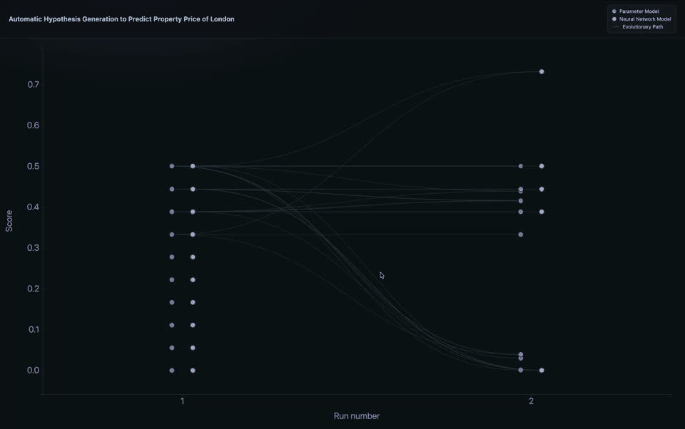

# Model Soup

**GitHub:** https://github.com/lucastsui/ModelSoup

# One-Line Summary
In one line: we created a framework to automate hypothesis generation, improvement, and verification.

# Abstract
Automating hypothesis generation and verification can accelerate knowledge discovery. A bottleneck in research workflow is to generate the correct hypothesis efficiently given the vast search space of possible hypotheses. We propose Model Soup, a method to overcome this bottleneck by using evolutionary method to select the whole research workflow, from selecting source data, the LLM model, whether the hypothesis is parameter based or neural network based, to mutating and breeding new hypothesis. We use a score that rewards cross-validated hit rate while penalizing coincidental hits in selecting offsprings. We test this method using a mix of historical housing price data from 1968 and political-economical unstructured news to predict the housing price of London. We find that the winning model is a neural network based model that predicts a 57% rise of property price every 10 years. The significance of this method lies in the fact that it can be expanded to other hypothesis searching problem where relevant source data is readily available and a measurable score can be defined.

## Abstract in Plain Words
A time consuming problem that researchers face daily is to come up with the correct theory that can explain past data and correctly predict the future. We solve this problem by using LLMs to propose vast amounts of theories using any source data and theory that they see fit. They can even propose a blackbox model if they think that is the right approach. We evaluate these theories and select the ones that are reasonable good and have them mixed and matched in a metaphorically reproductive way to spawn new hypotheses to be tested again. We use the prediction of housing price in London as the task of this experiment. We find that the winner hypothesis is not some sophisticated theory but a simple prediction that "the housing price of London rises by 58.1% every 10 years." We could expand this idea to other research as long as the data we have are relevant to the problem and success and be measured.

# Architecture
The Model Soup consists of these components:
- The data collector independently collects data from the Internet.
- The Scorer runs the hypotheses, cross validates and scores them.
- The evolver runs the evolution of the hypotheses by managing pools of models, considers models' evolution history; spawn new hypotheses, archive and remove bad models from the pools.

The meaning of model and hypothesis needs to be clarified here to avoid confusion. In the context of this project, a model here refers to various LLM-harness systems like Opus, DeepSeek, etc. A hypothesis is the algorithm, code based or not, to generate prediction based on the data maintained by the data collector.

We now describe each component of the framework.
## Data Collector
The data collector collects data to be passed as arguments or prompts to generate predictions. This component is independent from the rest of the framework and can be swapped with any data collection method. For this project, assuming that property price is a function of price trends and economic-political news as described in unstructured text, we pull these two sets of data dating back to 1968 as an arbitrary cut-off date. The exact data sources are listed in the reference section.
## Scorer
The scorer scores the prediction given by a hypothesis as benchmark for evolutionary selection. We use these techniques for the scoring algorithm for these purpose:
- Cross validation: each hypothesis sees only limited data with the reaming being used for cross validation to prevent the hypothesis from simply memorizing the raw data.
- Regularization: the score penalizes a hypothesis by number of predictions made so as to prevent the hypotheses from gaming the system by generating a large number of prediction in an attempt to score hits by chance.

To make a prediction falsifiable, it is defined to be a 9-tuple consisting:
1. price / rent — what you forecast
2. asking / sold price  — if applicable
3. aggregation — average, variance, etc.
4. area — where
5. as of date — when the prediction was made
6. start date — start of the change window
7. end date — end of the change window (after start; window should not precede as-of)
8. change percentage — predicted move from start to end
9. tolerated error — how far off still counts as a hit+

The score of a hypothesis is defined as:
$$
S = e^{-\mathrm{MAE}/s} \cdot (1 + \alpha \cdot h) \cdot \bigl(1 + \beta \cdot \max(0, -\Delta\mathrm{MAE})\bigr) \cdot \bigl(1 - e^{-n/n_0}\bigr)
$$
Explanation of terms:
- e^(−MAE/s): ranges from 0 to 1. more accurate prediction gives higher value.
- 1 + α ⋅ h: reward higher number of hit rates
- (1 + β ⋅ max(0, −ΔMAE)): reward decreasing MAE.
- 1 − e^(−n/n₀): penalize lucky model that coincidentally makes one hit.
Explanation of each variable:
- S — combined model score; higher is better
- MAE — mean absolute error of predicted vs actual change %, in percentage points
- s — scale that sets how hard MAE is punished
- h — hit rate: share of forecasts within tolerated error (0 to 1)
- α — weight on hit rate
- ΔMAE — recent MAE minus earlier MAE; negative means improving
- β — weight on improvement
- max(0, −ΔMAE) — size of improvement only; zero if not improving
- n — number of scored forecasts for this model
- n₀ — scale for how fast maturity rises with n
- e — base of the natural exponential

## Evolver
The evolver runs the evolution aspect of the framework. 

An LLM model takes the role of choose to provide intelligence in improve hypothesis design. To evenly distribute the effect of using different LLM models on evolution, Claude Opus 5 max effort, Grok 4.5 high effort, or DeepSeek v4 Flash is selected at random to be the chooser. It is then asked to consider either:
- the ancestral tree of a hypothesis to consider the overall trend of a strain of hypotheses; or
- two randomly selected hypotheses to mimic sexual reproduction.
Given a choose model and the hypotheses to consider, the LLM model is then prompted to generate a better hypothesis by tuning:
- parameter models with closed-form rules such as always-zero, last-month or year-on-year momentum, blends, mean reversion, bank-rate penalties, multi-lag momentum;
- a fitted linear regression model;
- neural models, which are linear neural head or a real MLP with chosen hidden layers, activation (ReLU/tanh), learning rate, steps, and L2.
- The chooser (Claude Opus 5 max effort, Grok 4.5 high effort, or DeepSeek v4 Flash),  

After each model of a pool are scored, the top-n models of the respective pool are selected to reproduce and the rest are deleted. And the next cycle begins. We arbitrarily set n=4 for parameter based models and n=3 for neural network based models.

On reproducing new hypotheses, there are no theoretical limits on the number of parents involved in reproducing an offspring hypothesis, That is, in principle, we can set all hypotheses ever defined can be a parent of a descendant hypothesis. To mimic biological bisexual reproduction and spontaneous mutation, as well as to keep computational demand manageable given our computation budget, the proposer generates new hypothesis by considering either of:
- A model's lineage. A hypothesis's lineage mean is a list of model-score pairs that traces the evolution of the model and the change in scores as the model evolves;
- Two random hypotheses in its pool; or
- Two random hypotheses across different pools.
# Method
We prepared property price political-economic news data listed in the Reference section, initialized 10 parameter based and neural network models each, and run the loop for 5 iterations.

# Results
The loop achieves a high score with just 5 iterations. The winner model is a neural network with a surprisingly simple prediction that London housing price increases by 57% every 10 years, defeating parameterized models. The best hypothesis traces its ancestry to both parameter based and neural network models.

# Discussion

Several observations stand out.

Freedom to mutate in theory structure does not necessarily lead to overfitting architecture if regularization is implemented. The strongest hypotheses in our runs are not elaborate narrative theories of politics and housing. They behave like approximate constant multi-year appreciation. In our choice of scoring system, mean absolute error is penalized exponentially, so local momentum and over-parameterized networks often overshoot and are culled. Model Soup therefore acts as a critic as much as a generator: LLM proposers can invent complex offspring, but selection keeps only what the score endorses.

All inputs leading to a hypothesis' generation could be subject to evolution pressure, including the LLM to be chosen as the supplier of intelligence. The architecture is not entangled with any particular LLM models. The role of LLM in this architecture is to reduce the search space of all possible hypotheses that could explain the data by detecting patterns in the raw data as well as the evolution history of parent hypotheses. In this project, for simplicity, we rotating among Opus, Grok, and DeepSeek to spread inductive bias across proposers, but there is no limitation subjecting LLM model selection to face the same evolutionary pressure as other hypothesis configurations.

# Limitations

Long-horizon UK house-price growth is comparatively easy for level-matching predictors. With a soft MAE scale, many mediocre hypotheses can obtain non-trivial scores. Results should not be read as a claim that Model Soup discovers the true theory of London housing; they show that the loop converges under this score on this data.

Although the collector ingests political and economic text, the hypotheses we score most successfully rely primarily on structured price and rate features (or near-constant forecasts). Integrating news more tightly, e.g. as first-class inputs with clear temporal causality and leakage controls, and how to curate them to be more effectively to be utilized by LLM models remain an open problem.

# Conclusion

We presented Model Soup, a framework that couples LLM-based proposal of executable prediction hypotheses with evolutionary selection under a falsifiable, cross-validated score. LLMs act as hypothesis choosers; hypotheses form dual parameter and neural pools, compete under top-n survival, and recombine through lineage, in-pool, and cross-pool parentage. On a multi-decade UK housing dataset with a 10-year forecast task, a small number of generations is enough to reach high scores; the strongest survivors are simple, level-like forecasts of multi-year appreciation rather than elaborate narratives. The contribution is a reusable method for automating hypothesis generation, mutation, and verification wherever relevant data and a measurable score exist. Addressing harder tasks, richer unstructured inputs, and diversity-aware selection are the main routes to broader scientific impact.

## Data sources

- UKHPI full file (HM Land Registry sold HPI): https://publicdata.landregistry.gov.uk/market-trend-data/house-price-index-data/UK-HPI-full-file-2026-05.csv
- Price Paid Data (HM Land Registry transactions): https://price-paid-data.publicdata.landregistry.gov.uk/pp-2026.csv
- Bank of England IADB (Bank Rate + mortgage series): https://www.bankofengland.co.uk/boeapps/database/_iadb-fromshowcolumns.asp?csv.x=yes&Datefrom=01/Jan/1975&Dateto=now&SeriesCodes=IUDBEDR,IUMBV34,IUMBV37,IUMBV42,IUMBV45,IUM2WTL,IUM5WTL,IUMTLMV&UsingCodes=Y&VPD=Y&VFD=N
- Rightmove House Price Index (asking): https://www.rightmove.co.uk/news/house-price-index/
- Rightmove mortgage rate tracker: https://www.rightmove.co.uk/news/articles/property-news/current-uk-mortgage-rates/
- Rightmove sold house prices (by city): https://www.rightmove.co.uk/house-prices/{city_slug}.html
- Rightmove for sale listings: https://www.rightmove.co.uk/property-for-sale/{City}.html
- Rightmove to rent listings: https://www.rightmove.co.uk/property-to-rent/{City}.html
- BBC Politics RSS: https://feeds.bbci.co.uk/news/politics/rss.xml
- Guardian Politics RSS: https://www.theguardian.com/politics/rss
