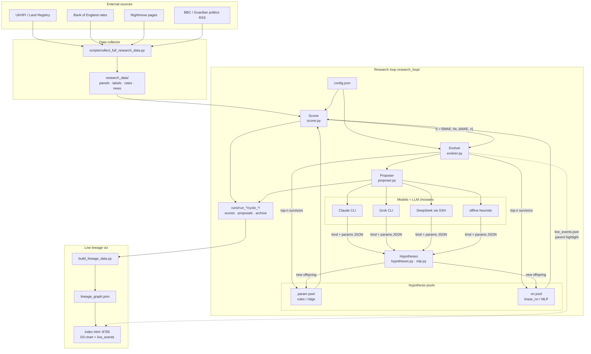
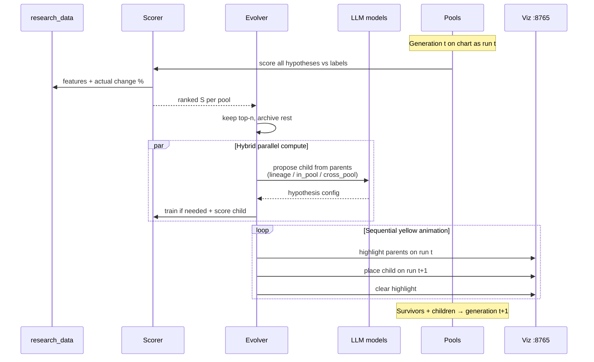
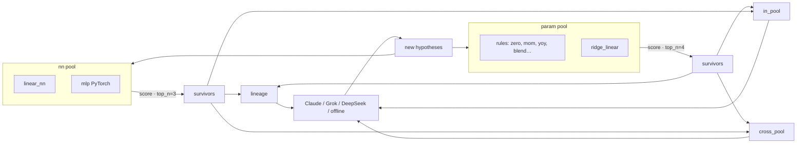

# PropView architecture (Model Soup)

Terminology (important):

| Term | Meaning |
|------|---------|
| **Model** | LLM proposer (Claude, Grok, DeepSeek, offline heuristic) |
| **Hypothesis** | Prediction algorithm (param rules, linear head, or MLP) |

## System overview

## One evolution cycle

## Dual pools and selection

## Score formula

\[
S = e^{-\mathrm{MAE}/s}\,(1+\alpha h)\,(1+\beta\max(0,-\Delta\mathrm{MAE}))\,(1-e^{-n/n_0})
\]

Falsifiable prediction: 9-tuple (target, aggregation, area, as-of, start, end, change %, tolerance, …).

## Key paths

| Piece | Path |
|-------|------|
| Collector | `scripts/collect_full_research_data.py` |
| Data | `research_data/` |
| Loop | `research_loop/` |
| Full run (hybrid) | `research_loop/run_full_evolution.py` |
| Viz | `research_loop/viz/` → http://127.0.0.1:8765/ |
| Design notes | Obsidian `PropView.md` |
